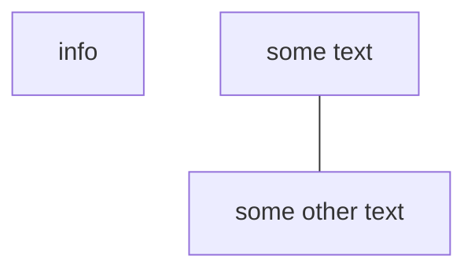

### my rules
- always log what i'm doing #habit
- make an effort to tag everything. #habit 
- no more than 3 tasks in "doing" at a time.
- always include yaml in note
- before leaving computer, go through every window i have open and ask myself
	- do i need to refer back to this later or continue working on this later? 
	- discard changes made or save changes? 
	- what is this for? update the project notes with the file you left off and where your thought process was 
- Desktop folder is always where new project folders default to. 
	- source code 
	- relevant project documentation 
	- this is where .git goes
# obsidian
## key
- [>] 
### A list of job aids that aid me in doing my job

- Desktop applications
	- Alfred
	- Setapp
		- Better Touch Tool
- Postman 
	- accounts
		- larralapid@gmail.com
- Github
- Bitbucket
- notion
