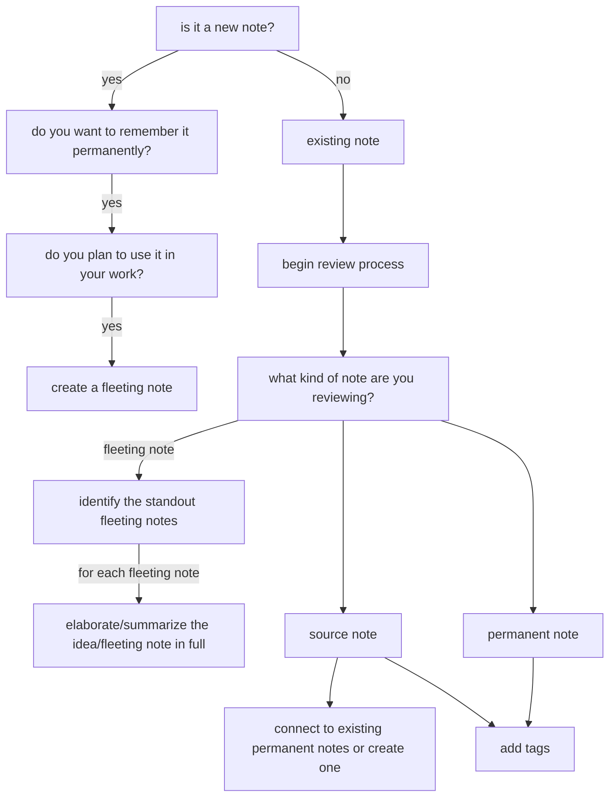

fleeting notes --> append to daily note 
literature / source notes 
- link to fleeting note
- write what you learned in your own words, tldr it (your interpretation
- only have one connection, the book they came from )

inbox
source notes (for literature notes/reference notes)
logbox (permanent notes)

process inbox at least 2-3 times a week
process daily notes every evening or morning

note types
	daily
		yyyy-mm-dd
	meeting
	fleeting
	source
	task
	
	