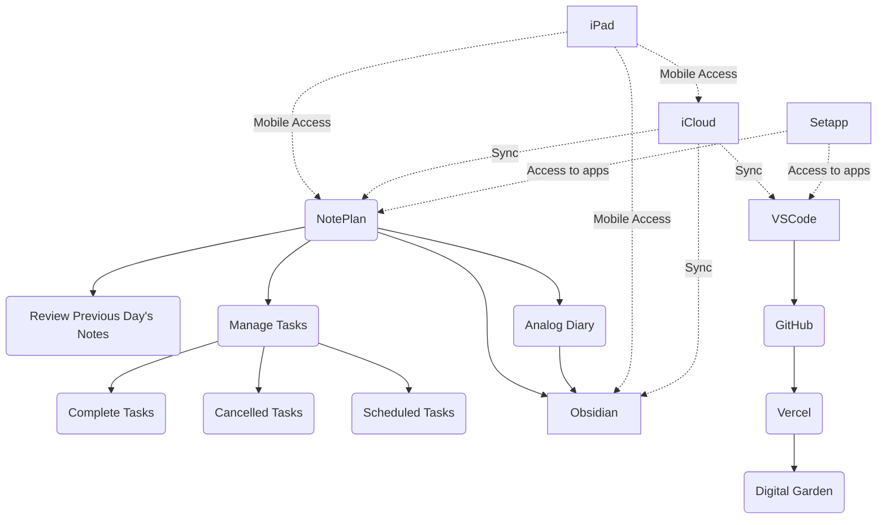

- [[noteplan]]
- [[raycast]]
- [[dotfiles]]
- devon
	- devonsphere express 
	- devonthink 3 pro
- bettertouchtool 
- setapp 
- streamdeck 
- macbook 
- vscode 
- github 
- typingmind
- hammerspoon 
- [[alfred]]

# hardware
- logitech lift vertical mouse