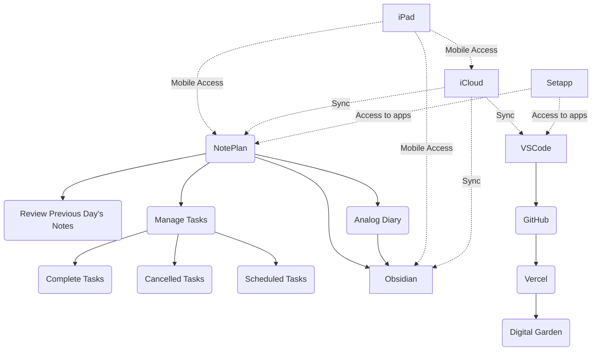

#### reference maps & standardization
- [[frontmatter attributes]]
#### toolsuite
- [[noteplan]]
- [[raycast]]
- [[dotfiles]]
- [[obsidian]]
- devon
	- devonsphere express 
	- devonthink 3 pro
- bettertouchtool 
- setapp 
- streamdeck 
- macbook 
- vscode 
- github 
- typingmind
- hammerspoon 
- [[alfred]]

# hardware
- logitech lift vertical mouse

---
- failed implementations
	- [[chrome]]
		- ~~Use browser profiles for "areas"~~ 
			- ~~testing profile~~
				- ~~test browser extensions~~ 
				- ~~test chrome flags~~ 
			- ~~dev profile~~ 
				- ~~chrome extension environment~~ 
			- ~~Research~~
				- ~~use tab groups per project~~ 