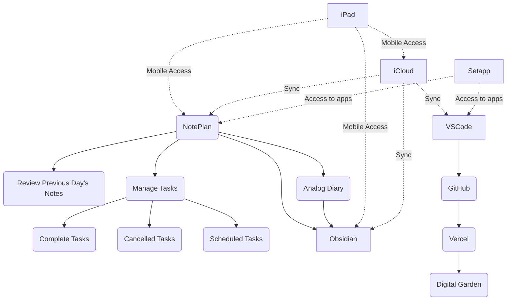

```mermaid
graph TD
NP(NotePlan) --> RPN(Review Previous Day's Notes)
NP --> MT(Manage Tasks)
	MT --> CT(Complete Tasks)
	MT --> CaT(Cancelled Tasks)
	MT --> ST(Scheduled Tasks)
	NP --> AD(Analog Diary)
		Setapp -.-> |Access to apps| NP
	Setapp -.-> |Access to apps| VSCode
	iCloud -.-> |Sync| NP
	iCloud -.-> |Sync| VSCode
	iCloud -.-> |Sync| Obsidian
	iPad -.-> |Mobile Access| NP
	iPad -.-> |Mobile Access| Obsidian
	iPad -.-> |Mobile Access| iCloud
	
	AD --> Obsidian
	NP --> Obsidian
		VSCode --> GH(GitHub)
		GH --> V(Vercel)
	V --> DG(Digital Garden)
```