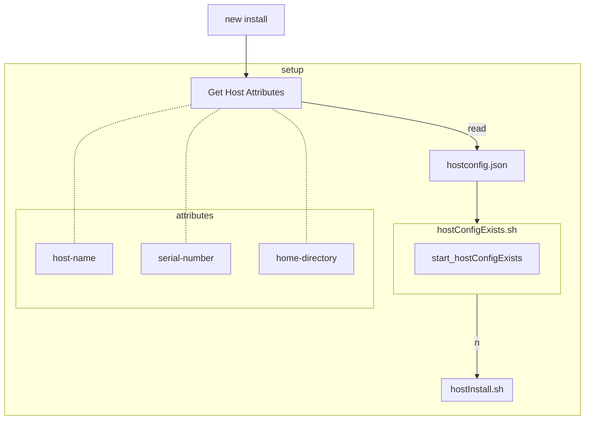

---
tags:
aliases:
cssclass:
created:
modified:
source:
---
[[dotfiles]]

```mermaid
%% this is a comment
%%{ init: { 'flowchart': { 'linear': 'stepAfter' } } }%%
graph TB
	new[new install]-->get-host
	subgraph setup
		direction TB
		hostconfig.json	
		get-host--read-->hostconfig.json-->hostConfigExists.sh--no-->hostInstall.sh
		subgraph attributes
			direction TB
			host-name
			serial-number
			home-directory
			end
				get-host[Get Host Attributes]-..-host-name
				get-host-..-serial-number
				get-host-..-home-directory
	subgraph hostConfigExists.sh
		start_hostConfigExists
		
		end
	subgraph hostInstall.sh

		end
		
		
	end


```
[[hostconfig.json 1]]