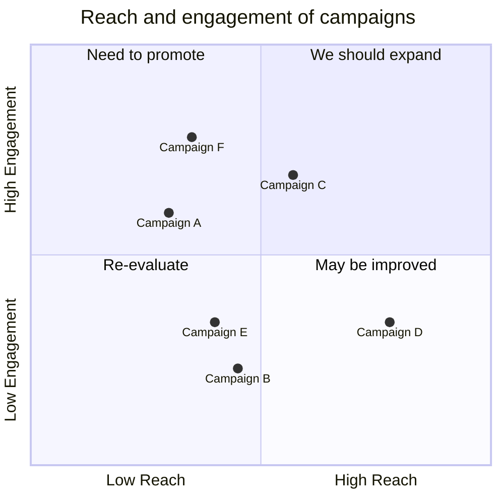

---
tags:
  - zettel
title: 20240413-0319am
created: 2024-04-13 03:19:44 AM
updated: 2024-04-13 03:23:07 AM
---

example of a quadrant chart created w/ the assistance of the [[notes/obsidian|obsidian]] plugin [[mermaid tools]]