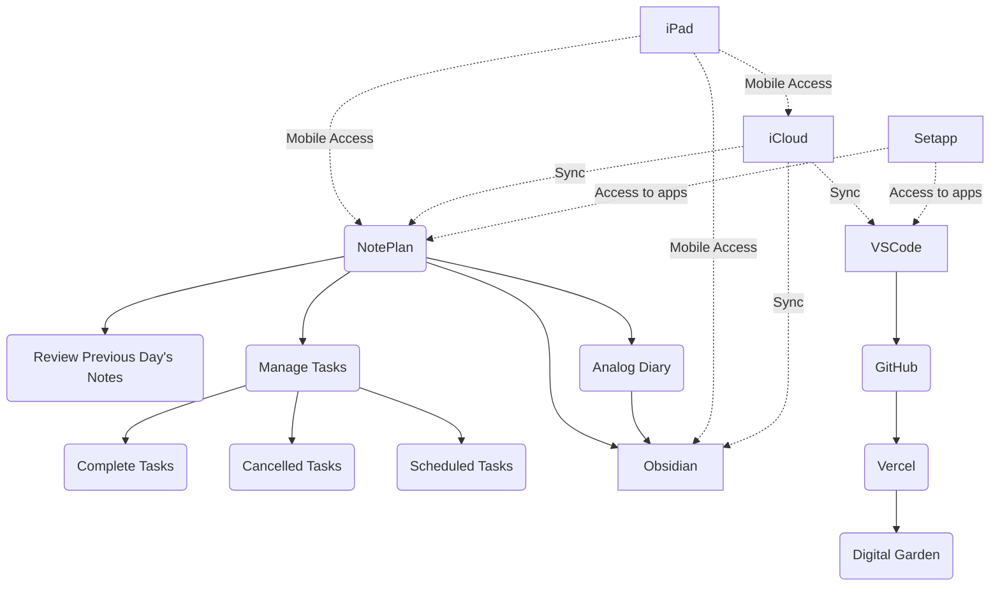

The one "thing" (idk what to call it. entry point? touch point? core component?) in my ecosystem that is engrained for the rest of my life is my analog [[notes/diaries|diaries]]
#### Reference Maps & Standardization
- [[frontmatter attributes]]

#### Toolsuite (digital touchpoints)
- [[noteplan]]
- [[raycast]]
- [[dotfiles]]
- [[obsidian]]
- devon
	- devonsphere express 
	- devonthink 3 pro
- bettertouchtool 
- setapp 
- streamdeck 
- macbook 
- vscode 
- github 
- typingmind
- hammerspoon 
- [[alfred]]

# Hardware
- logitech lift vertical mouse

---
- failed implementations
	- [[chrome]]
		- ~~Use browser profiles for "areas"~~ 
			- ~~testing profile~~
				- ~~test browser extensions~~ 
				- ~~test chrome flags~~ 
			- ~~dev profile~~ 
				- ~~chrome extension environment~~ 
			- ~~Research~~
				- ~~use tab groups per project~~ 

- using [[noteplan]] and [[obsidian]] in my Ecosystem flow
	- what kind of stuff goes in which? 
		- [[noteplan]] 
			- activity log 
			- decisions made 
			- active projects 
			- out of scope
				- zettels and fleeting thoughts 
				- consumption lists (reading list, to watch list)
				- irrelevant research 
	- [[obsidian]]
		- research 
		- zettels 
		- incomplete thoughts 
		- #til stuff 
		- #dicking-around activity logs 