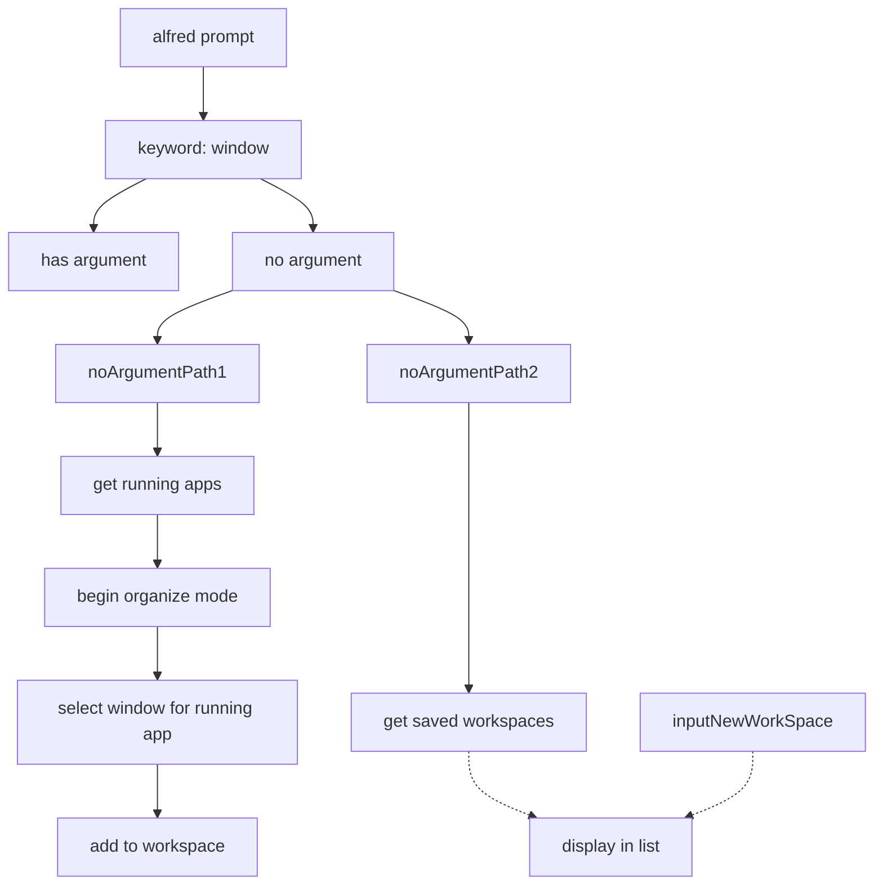

[[better touch tool]]

i want to quickly toggle from work windows to break time side project windows 
need to know which windows are work windows 
maybe i can create a variable that is an object of all active windows using either [[alfred]]

[[dotfiles]] 